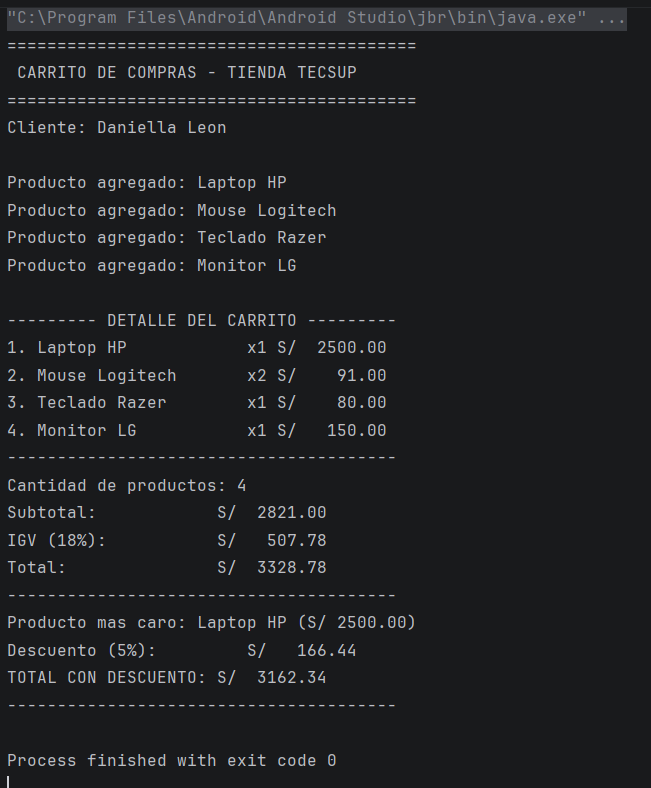

# Laboratorio 02 - Kotlin 

## - Daniella Leon
### Descripcion: 
Es un programa simple en Kotlin que simula un carrito de compras.

Para este laboratorio creé o completé las siguientes funciones:
- **Calcular IGV**: Saca el 18% del subtotal que calculamos antes.
- **Calcular Total**: Suma el subtotal con el IGV para saber el precio bruto.
- **Calcular Descuento**: Usa un `when` para dar un descuento extra. Si la compra pasa de S/ 3000 descuenta el 5%, y si pasa de S/ 5000 descuenta el 10%.
- **Mostrar Detalle**: Ordena la lista de productos en pantalla para que parezca un recibo real.
- **Encontrar el producto más caro**: Usé la función `maxByOrNull` de Kotlin para buscar de golpe el artículo que cuesta más dinero en todo el carrito.

### ¿Por qué val para nombre/precio y var para cantidad?
    Se usa val porque el nombre de la laptop y su precio
    original en la tienda se quedan fijos cuando los metes al carrito.
    Por otro lado se usa var en la cantidad de unidades porque necesita poder cambiar.
    Si el cliente decide llevar 2 mouses en vez de 1, el programa necesita 
    poder modificar ese número en el camino.

### ¿Qué pasa si intentas cambiar el precio?
    Si en el codigo intentas poner algo como producto.precio = 2300.0 
    pasara esto:El codigo no va a compilar y Android Studio te marcara
    la linea con un error en rojo. Te saldra el mensaje exacto:
    Val cannot be reassigned lo que significa que no se puede volver a 
    asignar un valor a un val porque es de solo lectura. 
    El programa no correra hasta que borres esa linea.

## Captura de ejecucion:

## Prompt para refactorizar el codigo aplicando POO

comportate como un experto programador en Kotlin y programacion orientada a objetos, refactoriza el siguiente codigo de manera que se use poo.

Mis requisitos obligatorios para la refactorizacion son:

Uso estricto de POO: Todo el codigo y las funciones sueltas deben encapsularse dentro de clases apropiadas (por ejemplo, una clase Carrito que maneje la lista de productos y los calculos).
Aplicar Polimorfismo: Modifica la clase o data class Producto para que sea una clase abstracta o interfaz base, y crea al menos dos subclases que hereden de ella (por ejemplo, ProductoDigital y ProductoFisico, o Electrodomestico y Accesorio) donde demuestres el polimorfismo aplicando un calculo o comportamiento distinto para cada tipo de producto.
Mantener la logica comercial: Se deben conservar las reglas de negocio actuales (el calculo del 18% de IGV, la logica de descuentos con when de 5% y 10%, la impresion con formato alineado, y la busqueda del producto mas caro mediante maxByOrNull).
Un solo archivo: Todo el codigo resultante (clases, interfaces, subclases y la funcion main) debe estar disenado para ejecutarse dentro de un unico archivo .kt.