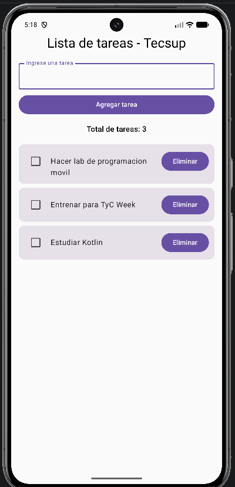
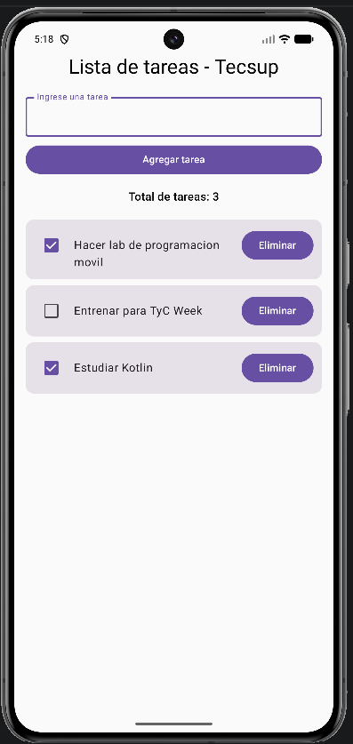

# Lista de Tareas

**Laboratorio 04 · Programación en Móviles**
Daniella León Andrés · Tecsup

App para anotar tareas, marcarlas cuando las terminas y borrarlas.

> Versión de la rama `sinia`: diseño propio, sin apoyo de IA.

---

## Así se ve

| Lista vacía | Con tareas | Una completada |
|:--:|:--:|:--:|
|  |  |  |

---

## Qué hace

- Escribes una tarea y pulsas **Agregar tarea**.
- Aparece en la lista con su checkbox y su botón Eliminar.
- Marcas el checkbox cuando la terminas.
- **Eliminar** la quita.
- Arriba se ve el total, que se actualiza solo.

Si el campo está vacío, el botón no hace nada.

---

## Cómo está hecho

Una `data class Tarea` con id, nombre y si está completada.

La lista se guarda en un `mutableStateListOf`, que es una lista que avisa cuando cambia:
por eso la pantalla se redibuja sola al agregar o borrar algo.

Se dibuja con `LazyColumn`, que solo muestra lo que cabe en pantalla.

Dos composables:

| | |
|:--|:--|
| `PantallaTareas()` | El título, el campo, el botón, el total y la lista |
| `ItemTarea()` | Una tarjeta suelta |

---

## Para correrlo

Abrir `Semana04` en Android Studio, esperar el Gradle sync y darle a Run.
Necesita Android 7.0 o más.
