<div align="center">

# Lista de Tareas

**Laboratorio 04 · Programación en Móviles**

Daniella León Andrés · Tecsup


<br/><br/>


</div>

Lo que hace la app, paso a paso:

- Escribes una tarea en el campo de texto y pulsas **Agregar tarea**.
- La tarea aparece en la lista con su propio color, rotando entre seis paletas.
- Al marcar el checkbox, la tarjeta se encoge, se apaga y el texto queda tachado.
- El botón de la papelera elimina la tarea.
- La tarjeta de progreso muestra el total y una barra que se llena según cuántas llevas completadas.

El campo no acepta tareas vacías: si el texto está en blanco, el botón no hace nada.

<div align="center">

<br/>



<br/>

</div>


|                  Lista vacía                  |                  Con tareas                   |              Algunas completadas              |
|:---------------------------------------------:|:---------------------------------------------:|:---------------------------------------------:|
|  |  |  |


<div align="center">

<br/>



<br/>


</div>

### El modelo

```kotlin
data class Tarea(
    val id: Int,
    val nombre: String,
    val completada: Boolean = false
)
```

Los tres campos son `val`, así que una tarea **no se modifica**: se reemplaza por una copia
nueva con `copy()`. Eso es lo que permite que Compose detecte el cambio y redibuje.

### El estado

```kotlin
var textoTarea by remember { mutableStateOf("") }
var contadorId by remember { mutableStateOf(1) }
val listaTareas = remember { mutableStateListOf<Tarea>() }
```

`mutableStateListOf` es una lista que **avisa cuando cambia**. Con una `mutableListOf` normal
se podrían agregar elementos, pero la pantalla no se enteraría y la lista no se redibujaría.

El `contadorId` da un id único a cada tarea. Sirve para el `key` del `LazyColumn`, que es lo que
permite a Compose saber qué tarjeta es cuál cuando se elimina una del medio.

### La lista

```kotlin
LazyColumn(
    verticalArrangement = Arrangement.spacedBy(12.dp)
) {
    itemsIndexed(listaTareas, key = { _, t -> t.id }) { index, tarea ->
        ItemTarea(
            tarea = tarea,
            bgColor = cardColors[index % cardColors.size],
            stripColor = stripColors[index % stripColors.size],
            ...
        )
    }
}
```

`LazyColumn` solo dibuja los elementos visibles en pantalla, a diferencia de una `Column`, que
los dibuja todos. Con listas largas, esa diferencia importa.

El `index % cardColors.size` es lo que hace rotar los colores: al llegar al sexto vuelve al primero.

### Marcar como completada

```kotlin
onCambiarEstado = { status ->
    val idx = listaTareas.indexOf(tarea)
    if (idx != -1) {
        listaTareas[idx] = listaTareas[idx].copy(completada = status)
    }
}
```

No se modifica la tarea: se busca su posición y se pone **una copia** con el campo cambiado.
Esa sustitución en la lista es lo que dispara la recomposición.

### Las animaciones

```kotlin
val scale by animateFloatAsState(
    targetValue = if (tarea.completada) 0.95f else 1f,
    animationSpec = spring(dampingRatio = 0.5f), label = "scale"
)
val alpha by animateFloatAsState(targetValue = if (tarea.completada) 0.6f else 1f, ...)
val animatedColor by animateColorAsState(...)
```

`animateFloatAsState` no cambia el valor de golpe: lo lleva de un número a otro durante unos
milisegundos, recomponiendo en cada paso. El `spring` con `dampingRatio = 0.5f` le da el rebote.

Los tres se aplican con `graphicsLayer`, que transforma la tarjeta sin volver a medirla, así que
la animación no afecta al resto de la lista.

### La barra de progreso

```kotlin
val completadas = listaTareas.count { it.completada }
val total = listaTareas.size
val progreso = if (total > 0) completadas.toFloat() / total else 0f
val progressAnimated by animateFloatAsState(targetValue = progreso, label = "progress")
```

El `if (total > 0)` evita dividir entre cero cuando la lista está vacía.

<div align="center">

<br/>



<br/>

</div>

```
Semana04/
├── app/src/main/
│   ├── java/com/leon/lab04/
│   │   ├── MainActivity.kt        data class + las 3 composables
│   │   └── ui/theme/              colores, tipografía y tema
│   └── res/drawable/fondo.png     imagen de fondo
└── build.gradle.kts
```

Las tres composables y su papel:

| Composable | Qué hace |
|:--|:--|
| `MainScreen()` | Pone la imagen de fondo y encima la pantalla |
| `PantallaTareas()` | Guarda el estado, el encabezado, el input, el progreso y la lista |
| `ItemTarea()` | Una tarjeta: franja de color, checkbox, texto y papelera |

`ItemTarea` no guarda estado propio: recibe la tarea y dos callbacks (`onEliminar`,
`onCambiarEstado`) y reporta hacia arriba. El estado vive en un solo sitio, en `PantallaTareas`.

### Para correrlo

Abrir la carpeta `Semana04` en Android Studio, esperar el Gradle sync y darle a Run.
Necesita Android 7.0 (API 24) o más.

---

### Ramas

Este proyecto existe en las dos ramas del repositorio:

- **`sinia`** — la versión que hice sin apoyo de IA
- **`main`** — el diseño final: fondo propio, colores rotativos y animaciones

<div align="center">
<br/>

</div>
