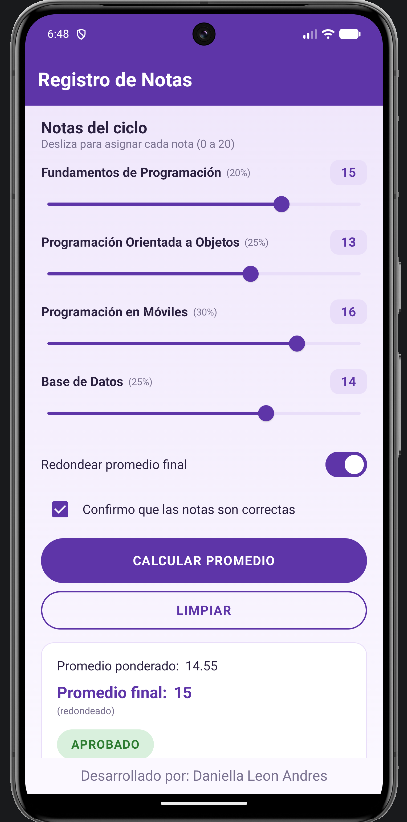
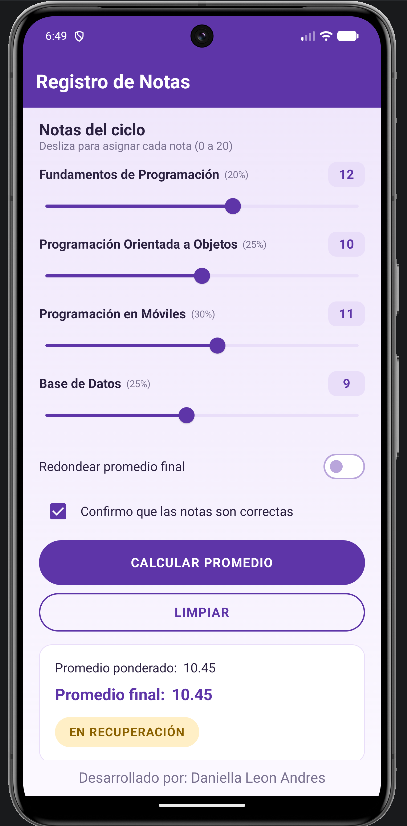
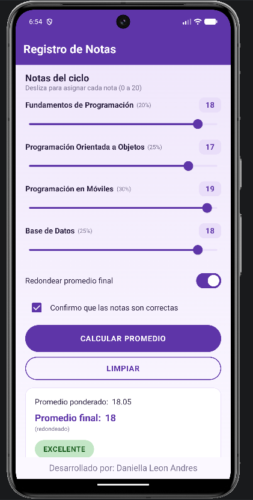
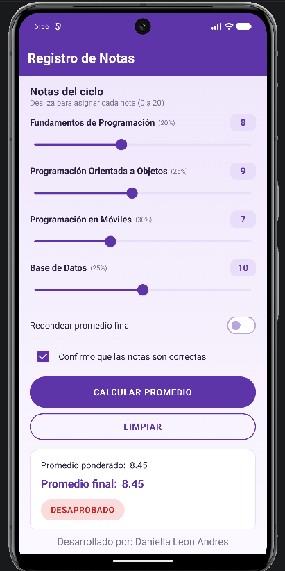

# Registro de Notas
## Daniella Leon Andres
App para calcular el promedio de 4 cursos usando Jetpack Compose.

## Pruebas y Capturas de Pantalla

Se hicieron los 4 casos de prueba del enunciado y funcionan correctamente.

### Redondear: ON - Aprobado

### Redondear: OFF - En Recuperacion

### Redondear: ON - Excelente

### Redondear: OFF - Desaprobado

## ¿Cómo funciona?

Se ingresan las notas de los 4 cursos y la app calcula el promedio según estos pesos:

| Curso                            | Peso |
| -------------------------------- | ---: |
| Fundamentos de Programación      |  20% |
| Programación Orientada a Objetos |  25% |
| Programación en Móviles          |  30% |
| Base de Datos                    |  25% |

También se puede activar el redondeo del promedio.
## Reto opcional

También se agregó el botón LIMPIAR, que reinicia las notas y los controles.

