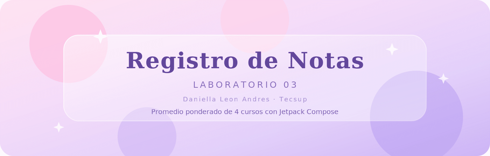
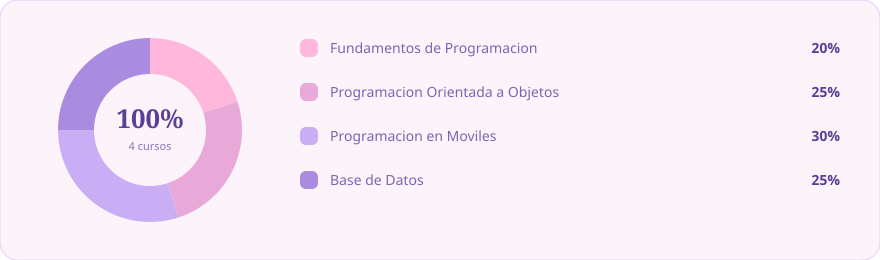
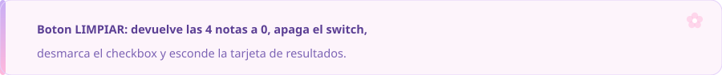

  

  

 

Los 4 casos de prueba del enunciado, corriendo en el emulador.

| Redondear ON — Aprobado | Redondear OFF — En Recuperación |
|:--:|:--:|
|  |  |
| **Redondear ON — Excelente** | **Redondear OFF — Desaprobado** |
|  |  |

 

 

**Promedio ponderado** = nota₁×0.20 + nota₂×0.25 + nota₃×0.30 + nota₄×0.25, con 2 decimales.

Si el switch está prendido, el promedio final se redondea con `roundToInt()`. Si no, se queda con los 2 decimales.

 

La observación sale del promedio **final**, no del ponderado:

| Promedio final | Observación | Color del chip |
|:--|:--|:--|
| 17 a 20 | EXCELENTE | verde oscuro |
| 13 a 16.99 | APROBADO | verde |
| 10 a 12.99 | EN RECUPERACIÓN | ámbar |
| menos de 10 | DESAPROBADO | rojo |

Los 4 casos están automatizados en `CalculadoraNotasTest.kt` y comparan el texto exacto que se ve en pantalla:

| Notas | Redondear | Ponderado | Final | Observación |
|:--|:--:|--:|--:|:--|
| 15, 13, 16, 14 | ON | 14.55 | 15 | APROBADO |
| 12, 10, 11, 9 | OFF | 10.45 | 10.45 | EN RECUPERACIÓN |
| 18, 17, 19, 18 | ON | 18.05 | 18 | EXCELENTE |
| 8, 9, 7, 10 | OFF | 8.45 | 8.45 | DESAPROBADO |

> **Detalle de precisión:** los pesos se guardan como enteros (20, 25, 30, 25) y recién al final se
> divide entre 100. Con decimales (`0.20`, `0.25`…) el último caso da `8.4499999…` y se mostraría
> `8.44` en vez de `8.45`.

 

 

Todos usan el mismo patrón del `TextField`: un valor y un callback.

 

El `Slider` usa `valueRange = 0f..20f` y `steps = 19` para que las notas sean enteras, y cada curso
tiene **su propia** variable de estado (cuatro `remember`).

 

 

### Para correrlo

Abrir la carpeta `RegistroNotas` en Android Studio, esperar el Gradle sync y darle a Run.
Necesita Android 7.0 (API 24) o más. Las pruebas: `./gradlew test`
